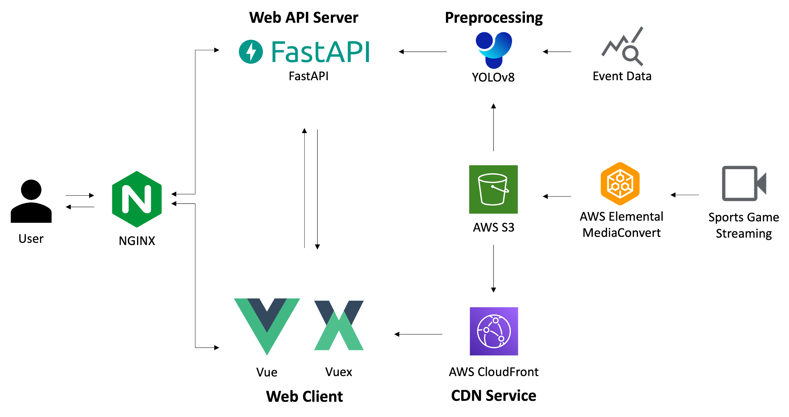
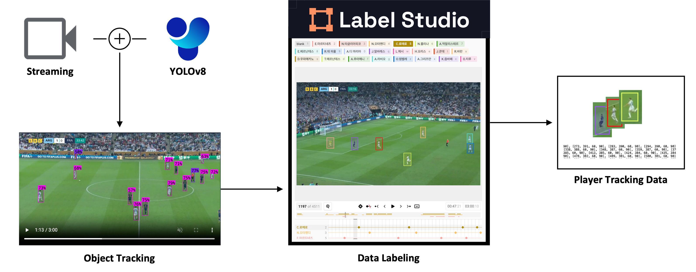
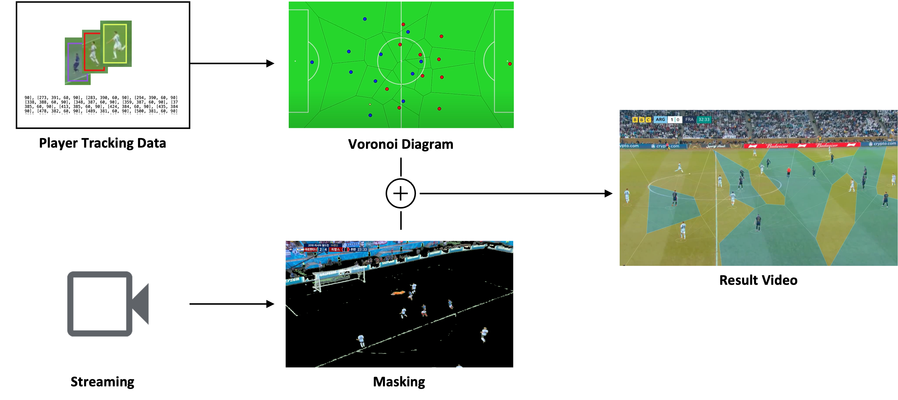

# Cross


---

##  프로젝트 개요

**Cross**는 객체 인식 기술과 실시간 데이터 시각화를 활용한 스트리밍 웹 서비스입니다. 기존의 일방적인 스포츠 중계와 달리, 상호작용 기반의 콘텐츠를 제공하여 시청자들이 축구를 보다 분석적이고 직관적으로 즐길 수 있도록 지원합니다.

###  핵심 가치
- **Enhanced Viewing**: 영상 위에 증강된 데이터를 통한 직관적 경기 시청
- **Player Recognition**: 객체 인식 기술 기반 실시간 선수 추적 시스템
- **Interactive Dashboard**: 사용자 맞춤형 드래그앤드롭 통계 대시보드
- **Real-time Analytics**: 실시간 경기 데이터 분석 및 시각화

---

##  주요 기능

###  선수 추적 및 인식 시스템
- 객체 추적 프로그램 기반 선수 라벨링 데이터 활용
- 실시간 선수 마킹 및 위치 추적
- 팀 정보 패널과 연동된 선수 정보 조회

###  데이터 시각화 대시보드 (4개 패널)
1. **능력치 비교 패널**: 레이더 차트 기반 선수 능력치 분석 및 비교
2. **실시간 기록 패널**: 막대 그래프로 실시간 경기 데이터 시각화
3. **공격 시퀀스 패널**: 실시간 공격 과정 및 볼 소유권 시각화
4. **슈팅 데이터 패널**: 슈팅 분포도 및 골 근접도 누적 데이터 분석

###  팀 정보 시스템
- 각 팀 선수 정보 상세 조회
- 선수 추적 버튼과 연계한 마킹 기능
- 실시간 선수 상태 정보 업데이트

###  영상 데이터 시각화
- **보로노이 다이어그램**: 선수별 영향력 공간 시각화
- **패스 데이터 시각화**: 좌표 데이터와 이벤트 데이터 결합 분석

---

##  기술 스택

### Frontend
```json
{
  "framework": "Vue.js 2.6.14",
  "state_management": "Vuex 3.6.2",
  "routing": "Vue Router 3.5.3",
  "video_streaming": "HLS.js 1.4.3",
  "data_visualization": "Chart.js 4.3.0 + vue-chartjs 5.2.0",
  "3d_graphics": "Three.js 0.145.0",
  "ui_components": "vuedraggable 2.24.3",
  "http_client": "Axios 1.2.0",
  "realtime": "Socket.IO Client 4.6.1"
}
```

### Backend (Streaming)
```json
{
  "runtime": "Node.js",
  "framework": "Express.js 4.18.2",
  "realtime": "Socket.IO 4.6.1",
  "environment": "dotenv 16.0.3"
}
```

**Note**: `exhibition-ver` 브랜치에서는 Node.js Backend 대신 AWS 클라우드 기반 영상 스트리밍 파이프라인을 구축하였습니다. AWS S3를 영상 원본 스토리지로, AWS CloudFront를 CDN으로 활용하여 클라우드 네이티브 아키텍처로 배포되었습니다.

### Backend (Analytics API)
```json
{
  "runtime": "Python",
  "framework": "FastAPI",
  "data_processing": "Pandas, NumPy",
  "environment": "Conda, Docker"
}
```

### Development Tools
```json
{
  "build_system": "Vue CLI 5.0.0",
  "code_quality": "ESLint + Prettier",
  "module_bundling": "Webpack (via Vue CLI)"
}
```

---

##  시스템 아키텍처

이 프로젝트는 **듀얼 백엔드(Dual Backend)** 구조로 설계되었습니다.

- **Node.js 스트리밍 백엔드**: HLS 비디오 스트리밍과 WebSocket을 이용한 실시간 통신을 담당합니다.
- **Python 분석 백엔드**: FastAPI를 기반으로, 경기 분석 데이터 요청을 처리하고 통계 정보를 가공하여 제공합니다.

```
┌─────────────────────┐     HTTP/API      ┌────────────────────────┐
│   Vue.js Frontend   │ ◄────────────────► │  Python/FastAPI Backend  │
│ (UI & Interactions) │                   │   (Data Analytics API)   │
└─────────────────────┘                   └────────────────────────┘
          ▲                                           │
          │ WebSocket/HTTP                            ▼
          │ (Video Stream)                  ┌──────────────────┐
          │                                 │   File System    │
┌──────────────────────┐                    │ (CSV, JSON Data) │
│   Node.js Backend    │                    └──────────────────┘
│ (Streaming & Sockets)│
└──────────────────────┘
```

**Alternative Architecture (exhibition-ver branch)**:
```
┌─────────────────────┐     HTTP/API      ┌────────────────────────┐
│   Vue.js Frontend   │ ◄────────────────► │  Python/FastAPI Backend  │
│ (UI & Interactions) │                   │   (Data Analytics API)   │
└─────────────────────┘                   └────────────────────────┘
          ▲                                           │
          │ HTTPS/HLS                                 ▼
          │ (Video Stream)                  ┌──────────────────┐
          │                                 │   File System    │
┌──────────────────────┐                    │ (CSV, JSON Data) │
│  AWS CloudFront CDN  │                    └──────────────────┘
│  (Global Delivery)   │
└──────────────────────┘
          │
          ▼
┌──────────────────────┐
│      AWS S3          │
│ (Video Storage)      │
└──────────────────────┘
```

---

##  개발 환경 설정

### 1. 의존성 설치

```bash
# Frontend (Vue.js)
cd frontend
npm install

# Streaming Backend (Node.js)
cd ../socket-backend
npm install

# Analytics Backend (Python)
cd ../backend
# Conda 환경 생성 (최초 1회)
conda env create -f environment.yml
```

### 2. 개발 서버 실행

**Frontend (Port: 8080)**
```bash
cd frontend
npm run serve
```

**Streaming Backend (Port: 3000)**
```bash
cd socket-backend
node server.js
```

**Analytics Backend (Port: 8000)**
```bash
cd backend
conda activate snakemake
uvicorn app.main:app --reload
```

---

##  프로젝트 구조

```
startup/
├── 📁 frontend/                    # Vue.js 프론트엔드 애플리케이션
├── 📁 socket-backend/              # Node.js 스트리밍 백엔드
│   ├── 📁 router/
│   ├── 📁 video/
│   └── 📄 server.js
├── 📁 backend/                      # Python 데이터 분석 백엔드
│   ├── 📁 app/
│   │   ├── 📁 common/             # 공통 설정 (Config)
│   │   ├── 📁 routes/             # API 라우트
│   │   │   └── 📁 endpoints/      # 엔드포인트 로직 (matches, tracking)
│   │   ├── 📁 schemas/            # 데이터 유효성 검증 스키마
│   │   └── 📄 main.py              # FastAPI 애플리케이션 진입점
│   ├── 📁 matches/                  # 경기 데이터 (CSV, JSON)
│   └── 📄 Dockerfile
├── 📄 TECHNICAL_DOCUMENTATION.md
└── 📄 README.md
```

---

##  API 엔드포인트

### 스트리밍 및 소켓 API (Node.js)

- **`GET /video/:videoName`**: HTTP Range Request를 지원하는 비디오 스트리밍
- **`GET /audio/:audioName`**: 오디오 스트리밍
- **`WebSocket`**: 실시간 통신을 위한 소켓 연결

### 분석 데이터 API (Python/FastAPI)

- **`GET /routes/matches/lineup/{time}`**: 특정 시간에 출전 중인 선수 목록 조회
- **`GET /routes/matches/stats/{time}`**: 특정 시간까지의 경기 및 선수별 상세 통계 데이터 집계
- **`GET /routes/matches/sequence/{time}`**: 현재 시간 기준 공격 시퀀스 데이터 조회
- **`GET /routes/matches/shots/{time}`**: 슈팅 및 기대 득점(xG) 데이터 조회
- **`GET /routes/tracking/info/{frame}`**: 특정 프레임의 선수 및 공 트래킹 좌표 데이터 조회

---

##  개발 및 테스팅

### 사용 가능한 스크립트 (Frontend)
```bash
npm run serve      # 개발 서버 실행
npm run build      # 프로덕션 빌드
```

---

##  프로젝트 성과 및 특징

### 시스템 아키텍처 설계

#### 전체 시스템 구조


Cross는 **3-tier 아키텍처**로 설계되어 Frontend, Streaming Backend, Analytics Backend가 독립적으로 동작하며 효율적으로 통신합니다.

#### 데이터 처리 파이프라인


축구 경기의 트래킹 데이터를 수집하고 전처리하는 파이프라인을 구축했습니다.

#### 시각화 시스템


Player Tracking Data와 Voronoi Diagram을 결합하여 영상 위에 증강된 데이터 시각화를 제공하는 렌더링 시스템입니다.

---

###  스트리밍 및 성능
- **HLS 적응형 스트리밍**: HLS.js를 활용하여 네트워크 상태에 따라 비디오 품질을 자동 조절하는 적응형 스트리밍을 구현했습니다.
- **효율적인 비디오 시킹**: HTTP 206 Partial Content 응답을 처리하여, 대용량 비디오 파일에서도 빠르고 효율적인 탐색(seeking)이 가능하도록 최적화했습니다.
- **대규모 스트리밍 데이터 관리**: 6,000개 이상의 HLS 세그먼트(.ts) 파일과 다중 비디오 스트림(video.m3u8, video_passroot.m3u8 등)을 안정적으로 관리하는 시스템을 구축했습니다.

###  인터랙티브 UI 및 데이터 시각화
- **사용자 맞춤형 대시보드**: vuedraggable 라이브러리를 사용하여 사용자가 직접 PlayerStats, MatchStats 등의 통계 컴포넌트를 드래그앤드롭으로 배치할 수 있는 동적 대시보드를 구현했습니다.
- **실시간 데이터 시각화**: Chart.js 기반의 막대(Bar) 및 레이더(Radar) 차트를 통해 스포츠 통계 데이터를 효과적으로 시각화했습니다.
- **체계적인 상태 관리**: Vuex를 도입하여 비디오 재생 상태, UI 컴포넌트의 표시 여부, 대시보드 레이아웃 등 복잡한 상태를 중앙에서 체계적으로 관리합니다.

#### 주요 시각화 기능 시연

**보로노이 다이어그램 기반 선수 영향력 시각화**


선수들의 위치 데이터를 기반으로 보로노이 다이어그램을 생성하여, 경기장 내 각 선수의 지배 영역과 영향력을 직관적으로 표현합니다.

**패스 네트워크 및 루트 시각화**


경기 이벤트 데이터와 좌표 데이터를 결합하여 팀의 패스 네트워크와 공격 루트를 영상 위에 시각화합니다.

### 데이터 분석 및 API 서버
- **FastAPI 기반 분석 서버**: Python의 FastAPI와 Pandas를 사용하여 대용량 경기 데이터(CSV)를 실시간으로 가공하는 분석 API 서버를 구축했습니다.
- **동적 데이터 집계**: 영상 재생 시간에 맞춰 관련 경기 이벤트들을 동적으로 필터링하고, 선수별 스탯, 공격 시퀀스, 기대 득점(xG)과 같은 정제된 데이터를 계산하여 제공합니다.
- **컨테이너화된 백엔드**: Docker를 통해 Python 실행 환경을 컨테이너화하여, 개발 및 배포 환경의 일관성과 확장성을 확보했습니다.

